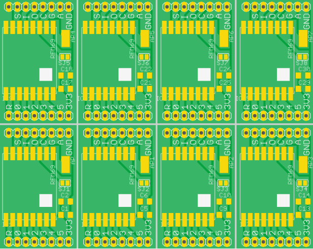

RFM69 / ESP-03 Breakout Board
=============================

Combination breakout for the RFM69 RF module, and the ESP-03 wifi module.

Status
------

Currently unproven, order has been sent to fab.

Revision History
----------------

* v1.0 - Inital Board
* v1.x (WIP)
 * Add revision number to silkscreen

Notes
-----

* SJ1 can be closed for when using an RFM69, it will join both grounds on the RFM69 together.
* Pad AP can be used when using an RFM69, as a location for soldering a wire antenna. 

Board
-----

Front:

Back:

Panel Board
-----------

Front:

Back:

Schematic
---------

